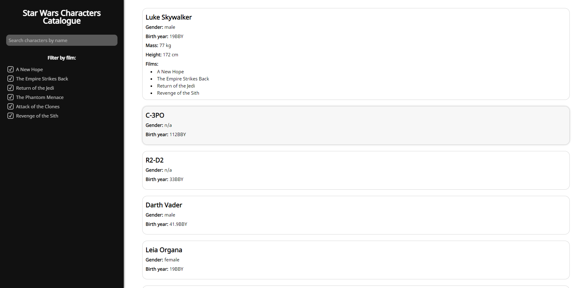
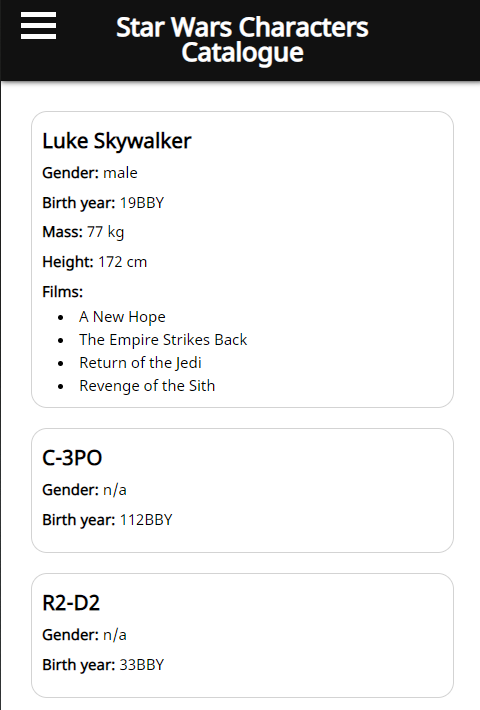

# Star Wars Catalogue

It's a simple React app that displays data about Star Wars characters. The data comes from SWAPI (https://swapi.dev/).

## Features
* Displaying data about characters
* Filtering characters by film
* Searching characters by name
* The app is fully responsive

## Screenshots




## Setup
Download the source code and perform:
```
npm install
npm start
```
To install dependencies and run the app.

## Code samples
```javascript
    const loadMoreCharacters = async () => {
    setIsLoadingMore(true);

    const result = await axios(
      `https://swapi.dev/api/people/?search=${searchQuery}&page=${Math.floor(
        characters.length / 10 + 1
      )}`
    );
    const firstElement = characters.length % 10;
    const lastElement = firstElement + 5;
    const additionalFiveCharacters = result.data.results.slice(
      firstElement,
      lastElement
    );
    const newCharacters = characters.concat(additionalFiveCharacters);
    setCharacters(newCharacters);

    setIsLoadingMore(false);
  };
```

The above function loads only 5 new characters from the API.

```jsx
    <AnimateHeight duration={500} height={isOpen ? "auto" : 0}>
        <div className="collapse">
          <p>
            <strong>Mass:</strong> {character.mass} kg
          </p>
          <p>
            <strong>Height:</strong> {character.height} cm
          </p>
          <p className="films">
            <strong>Films:</strong>
          </p>
          <ul>
            {character.films.map((characterFilm) => (
              <li key={characterFilm}>
                {films.find((film) => film.url === characterFilm).title}
              </li>
            ))}
          </ul>
        </div>
    </AnimateHeight>
```

The above code displays additional data about character after the character card is clicked on and gets the titles of the movies in which the character appears.

## Technologies
* React.js
* SWAPI (https://swapi.dev/)
* Axios
* react-animate-height